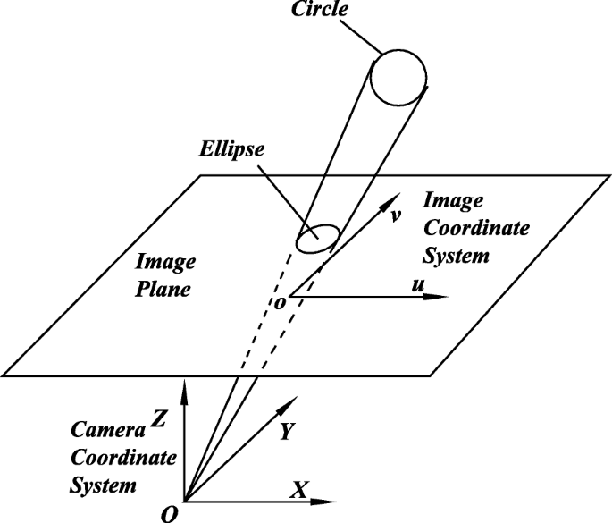

# Purpose 
The primary purpose of the provided code is to find the coefficients of the ellipse that is formed due to the perspective distortion of an original circle. 

## Code Structure

### Main Modules and Functions

#### `CamPlane` Class

- Represents a camera plane with a specific point, direction vector, and focal length.
- Normalizes the direction vector and calculates the camera plane point.

#### `CamSim` Function

- Simulates the projection of 3D points onto a 2D plane based on the camera plane.
- Transforms the object points relative to the camera plane.
- Plots the 2D projection of the 3D points.

#### `testCamSim` Function

- Calculates distances between transformed points and the camera plane point.

#### `ProjectEllipse2Cone` Function

- Projects an ellipse defined by its coefficients onto a cone.

#### `CheckCircle` Function

- Checks if the projected points satisfy the cone equation.

#### `plotSutface` Function

- Plots the surface defined by the cone equation.

### Main Execution Block

The main block of the code performs the following steps:

#### Data Generation

- Generates data for an ellipse in 3D space.

#### Camera Plane Initialization

- Creates a `CamPlane` object with a specified point, direction vector, and focal length.

#### Camera Simulation

- Simulates the camera projection and calculates the 2D projected points.

#### Ellipse Coefficient Calculation

- Uses the `Ellipse` module to find the coefficients of the ellipse from the 2D projected points.

#### Ellipse to Cone Projection

- Projects the ellipse onto a cone using the `Cone` module.

#### Cone Check

- Checks if the projected points satisfy the cone equation using the `CheckCircle` function.

#### 3D Plotting

- Plots the original 3D points and saves the plot as an image.

